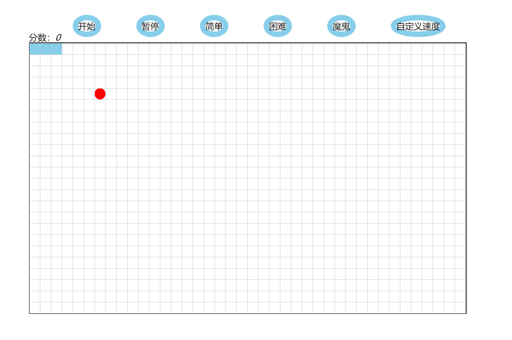

贪吃蛇🐍
==========
- 使用技术: HTML+CSS+JavaScript
- 一个简单的贪吃蛇项目。适合刚学js的新人练手。同样这也是我刚学JS时所写故代码还很不足，希望大家可以fork修改。
- 由于当时不会使用canvas画图，想起table标签，故使用表格来进行绘制地图。
- 🐍我使用二维数组来定义它的坐标。🐍移动则将蛇头前面的格子添加属性名加上样式。
- 对于食物我做了一个简单的判断，如果随机生成的食物在🐍身上，则重新调用食物函数。这样就解决食物在🐍里的bug。
- 按键过快时会产生冲突导致bug，故我设定了一个延时函数将按键锁定0.1S。

